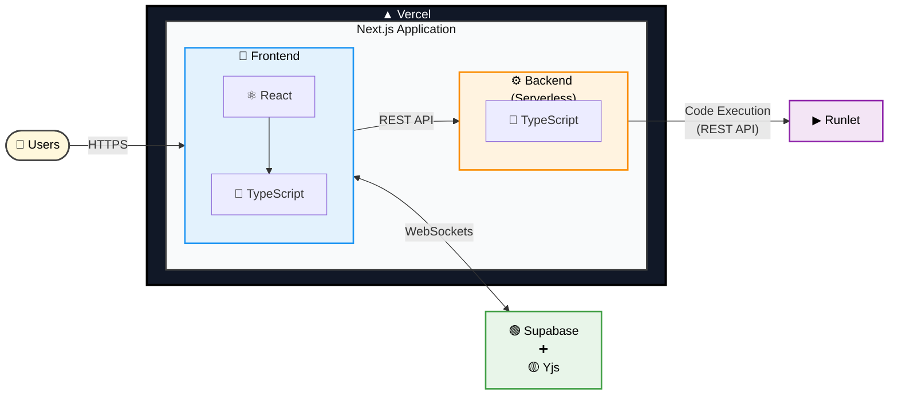

# 🚀 Dev Along
### Real-Time Collaborative Coding Platform


Create a room, share the link, and code together instantly. No sign-up required. Dev Along is a browser-based collaborative coding platform designed for pair programming, technical interviews, mentoring sessions, and collaborative learning. It supports Python, JavaScript, C++, and Java with real-time synchronization and integrated code execution.

---

# 🌐 Live Demo

**https://dev-along.vercel.app/**

---

# 🏗 System Architecture


The application is built with **Next.js** and deployed on **Vercel**. Real-time collaboration is powered by **Yjs**, using **y-supabase** to synchronize editor state, cursors, and document changes through **Supabase Realtime**.

Code execution is handled through a Next.js API route that securely proxies execution requests to the **Runlet** service. The project initially used **JDoodle** before migrating to **Runlet**, providing complete control over the execution environment while exploring secure remote code execution.

---

# ✨ Key Highlights

- 🚀 Instant collaborative coding
- 👥 Real-time multiplayer editor
- ✍️ Live cursor synchronization
- ▶️ Execute code directly from the browser
- 🔗 Share coding rooms with a single link
- 💻 Supports Python, JavaScript, C++, and Java
- ⚡ Powered by Next.js, Yjs, Supabase, and Runlet
- 🔒 No authentication required

---

# 🛠 Technology Stack

| Category | Technology |
|----------|------------|
| Framework | Next.js |
| Language | TypeScript |
| UI | React |
| Code Editor | Monaco Editor |
| Collaboration | Yjs |
| Sync Provider | y-supabase |
| Backend | Next.js API Routes |
| Database & Realtime | Supabase |
| Code Execution | Runlet |
| Deployment | Vercel |

---

# 📂 Repository Structure

```text
.
├── app/
├── components/
├── hooks/
├── lib/
├── public/
│   └── architecture.png
├── styles/
├── types/
├── utils/
├── package.json
└── README.md
```

---

# 💻 Modules

## 🌐 Frontend

> **Description**  
> Built with Next.js and React, the frontend provides a responsive Monaco-based code editor, language selection, room sharing, and seamless collaboration directly in the browser.

> **Tech Stack**  
> Next.js • React • TypeScript • Monaco Editor

---

## 🔄 Real-Time Collaboration

> **Description**  
> Uses Yjs together with y-supabase to synchronize editor content, cursor positions, and document updates instantly between connected users through Supabase Realtime.

> **Tech Stack**  
> Yjs • y-supabase • Supabase Realtime

---

## ⚙ Backend API

> **Description**  
> Next.js API routes securely proxy execution requests to the remote execution service while keeping sensitive execution logic isolated from the client.

> **Tech Stack**  
> Next.js API Routes • TypeScript

---

## ▶ Code Execution

> **Description**  
> Source code is executed through the Runlet execution service, supporting multiple programming languages in a secure remote environment.

> **Supported Languages**  
> Python • JavaScript • C++ • Java

---

# 🚀 Getting Started

## 1. Clone the Repository

```bash
git clone https://github.com/Nravitejareddy/Dev-Along.git

cd Dev-Along
```

---

## 2. Install Dependencies

```bash
npm install
```

---

## 3. Configure Environment Variables

Create a `.env.local` file in the project root.

```env
NEXT_PUBLIC_SUPABASE_URL=https://your-project.supabase.co

NEXT_PUBLIC_SUPABASE_PUBLISHABLE_KEY=your_publishable_key
```

### Environment Variables

| Variable | Description |
|----------|-------------|
| `NEXT_PUBLIC_SUPABASE_URL` | Supabase project URL |
| `NEXT_PUBLIC_SUPABASE_PUBLISHABLE_KEY` | Supabase publishable (anon) key |

---

## 4. Start the Development Server

```bash
npm run dev
```

Open your browser:

```text
http://localhost:3000
```

---

# 📈 Future Roadmap

- 📁 Multi-file project support
- 👤 User authentication and profiles
- 💾 Persistent coding history
- 🎥 Live video collaboration
- 🎙 Voice chat during coding sessions
- 🐳 Docker-based execution environments
- 📄 Collaborative whiteboard and notes
- 🌍 Additional programming language support

---

# 🤝 Contributing

Contributions are welcome!

1. Fork the repository.
2. Create a feature branch.

```bash
git checkout -b feature/your-feature
```

3. Commit your changes.

```bash
git commit -m "Add amazing feature"
```

4. Push your branch.

```bash
git push origin feature/your-feature
```

5. Open a Pull Request.

---

# 📄 License

This project is licensed under the **MIT License**. See the **LICENSE** file for more information.

---

# 👨‍💻 Author

**Ravi Teja Reddy N**

Computer Science & Engineering Graduate

🐙 GitHub: https://github.com/Nravitejareddy

---

# ⭐ Project Status

> ✅ **Live and actively maintained** — Dev Along is fully functional and continues to evolve with new collaboration features and platform improvements.

---

> **Dev Along — Code Together. Learn Together. Build Together.**
````
