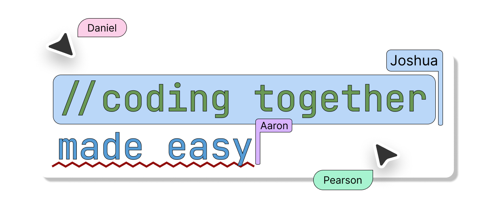
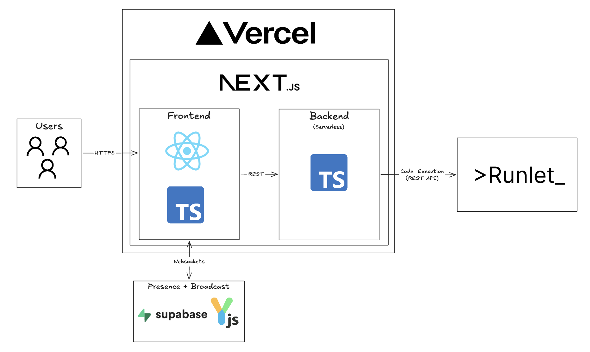

Create a room, share the link, and code together instantly. No sign-up required. Perfect for pair programming, technical interviews, collaborative learning, and mentoring sessions. Supports Python, JavaScript, C++, and Java.

**🌐 Live Demo:** https://devalong.live

---

# Architecture



The entire application is built with the [Next.js](https://nextjs.org/) framework and deployed on Vercel. Real-time collaboration is powered by [Yjs](https://yjs.dev/), using [y-supabase](https://github.com/supabase-community/y-supabase) as the synchronization provider to keep editor state synchronized through Supabase Realtime.

Code execution is handled through a Next.js API route that proxies requests to the [Runlet](https://github.com/GiridharRNair/Runlet) execution service. The project originally relied on [JDoodle](https://www.jdoodle.com/) for running code but was later migrated to Runlet to gain full control over the execution environment while learning how to build a secure code execution service.

---

# Features

- 🚀 Instant collaborative coding
- 👥 Real-time multiplayer editor
- ✍️ Live cursor synchronization
- ▶️ Execute code directly from the browser
- 🔗 Share coding rooms with a single link
- 💻 Supports Python, JavaScript, C++, and Java
- ⚡ Powered by Next.js, Yjs, Supabase, and Runlet
- 🔒 No authentication required

---

# Tech Stack

| Category | Technology |
|----------|------------|
| Framework | Next.js |
| Language | TypeScript |
| UI | React |
| Code Editor | Monaco Editor |
| Collaboration | Yjs |
| Sync Provider | y-supabase |
| Backend | Next.js API Routes |
| Database & Realtime | Supabase |
| Code Execution | Runlet |
| Deployment | Vercel |

---

# Local Development

## Prerequisites

- [Node.js](https://nodejs.org/) v18+
- A [Supabase](https://supabase.com/) project

## Setup

### 1. Clone the repository

```bash
git clone https://github.com/Nravitejareddy/Dev-Along.git
cd Dev-Along
npm install
```

### 2. Configure environment variables

Create a `.env.local` file in the project root.

```env
NEXT_PUBLIC_SUPABASE_URL=https://<your-supabase-project>.supabase.co
NEXT_PUBLIC_SUPABASE_PUBLISHABLE_KEY=<your-supabase-publishable-key>
```

### 3. Start the development server

```bash
npm run dev
```

Open your browser and visit:

```text
http://localhost:3000
```

---

# Project Structure

```text
.
├── app/
├── components/
├── hooks/
├── lib/
├── public/
│   ├── architecture.png
│   └── readme-header.png
├── styles/
├── types/
├── utils/
├── package.json
└── README.md
```

---

# Contributing

Contributions are welcome!

1. Fork the repository
2. Create a feature branch

```bash
git checkout -b feature/your-feature
```

3. Commit your changes

```bash
git commit -m "Add amazing feature"
```

4. Push to GitHub

```bash
git push origin feature/your-feature
```

5. Open a Pull Request

---

# License

This project is licensed under the **MIT License**. See the [LICENSE](LICENSE) file for more information.
